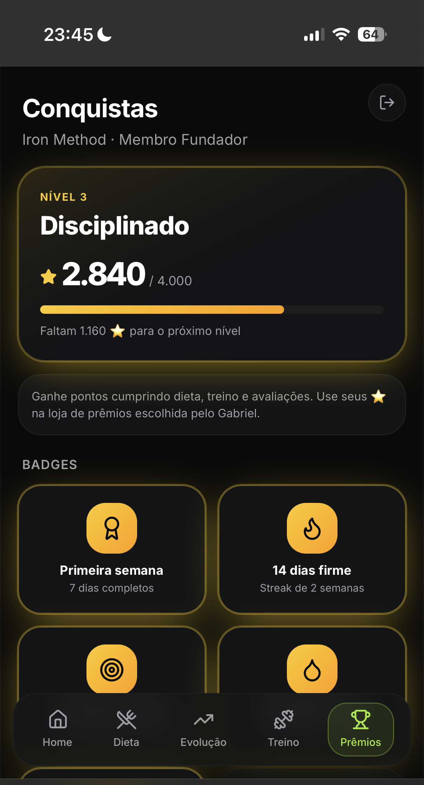
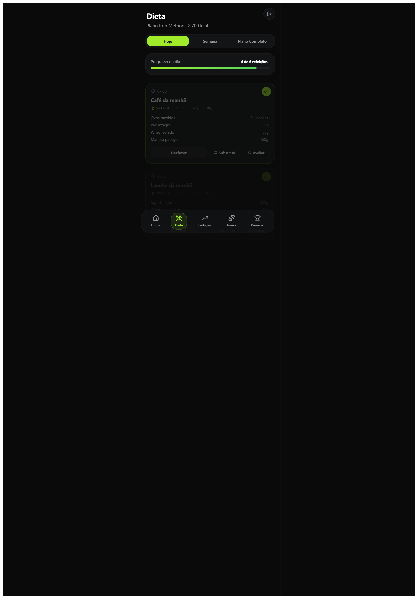
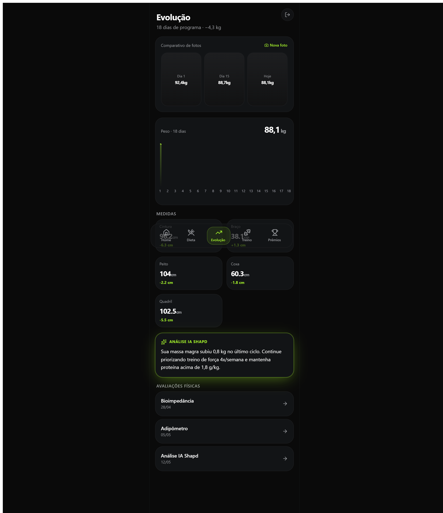
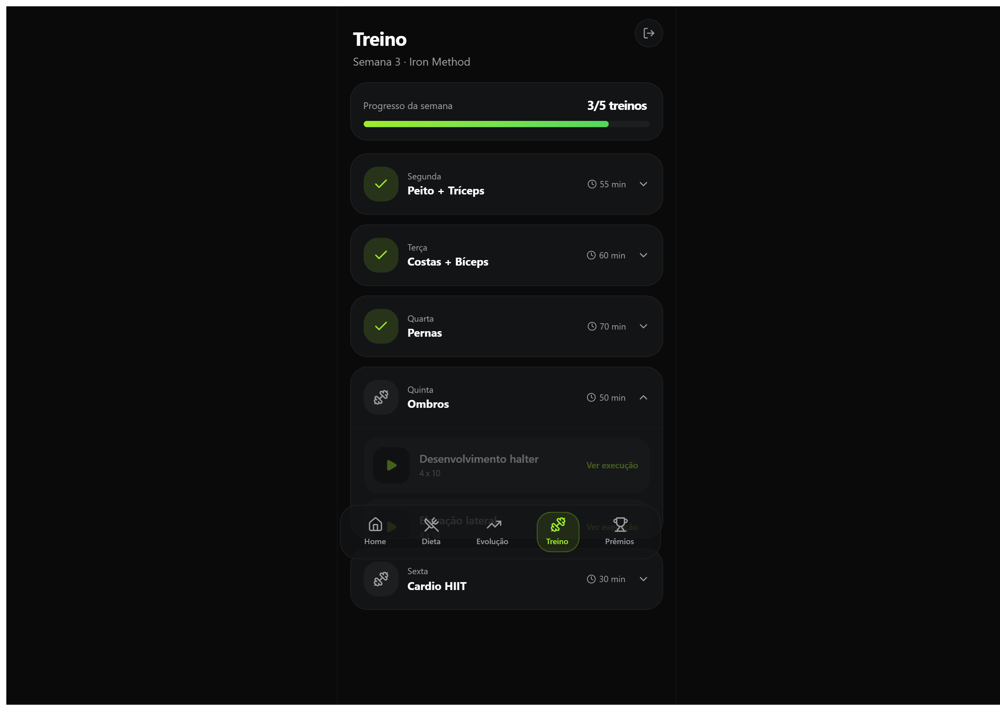

# Iron Coach 💪

> Protótipo de app de acompanhamento nutricional, feito sob medida para a Iron Nutrição Esportiva — visibilidade total da jornada do paciente na palma da mão.

<table>
<tr>
<td width="50%"> Home: progresso, próxima consulta e KPIs do dia</td>
<td width="50%"> Dieta: refeições do dia com macros</td>
</tr>
<tr>
<td width="50%"> Evolução: comparativo de fotos e gráfico de peso</td>
<td width="50%"> Treino: semana por grupo muscular</td>
</tr>
</table>

## Sobre

Protótipo de telas (sem backend, dados mockados) construído para servir de material de venda/demonstração do novo programa "Iron Method" do nutricionista Gabriel Pedrosa. O objetivo era mostrar, com uma tela real e navegável, o que o paciente enxerga no dia a dia: dieta, evolução, treino e gamificação — tudo pensado sob medida pro atendimento do Gabriel, não como ferramenta genérica.

## Funcionalidades

- **Home**: progresso rumo ao objetivo, próxima consulta com o coach, KPIs do dia (peso, % de gordura, streak, pontos) e a refeição atual pra marcar como feita
- **Dieta**: refeições do dia com horário, calorias e macros, opção de substituir alimento e avaliar a refeição
- **Evolução**: fotos comparativas, gráfico de peso, medidas corporais com variação, e histórico de avaliações físicas (bioimpedância, adipômetro, análise por IA)
- **Treino**: semana de treino por grupo muscular, lista de exercícios com execução
- **Prêmios**: sistema de pontos e nível, conquistas desbloqueáveis e prêmios resgatáveis (camiseta, consulta extra, kit suplementos)

## Stack

`React` `TypeScript` `Tailwind CSS` `Recharts` `Framer Motion`

## Status

✅ Protótipo entregue como material de demonstração/venda.

---

Feito por [Caio Cruz](https://github.com/CaiioFe) · [iacaio.com.br](https://iacaio.com.br)
